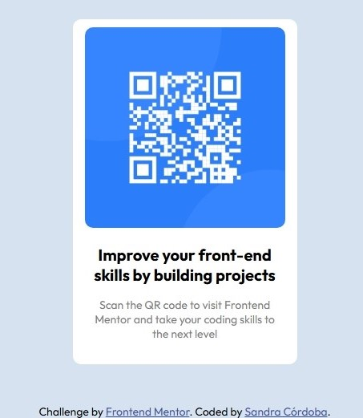

# Frontend Mentor - QR code component solution

This is a solution to the [QR code component challenge on Frontend Mentor](https://www.frontendmentor.io/challenges/qr-code-component-iux_sIO_H). Frontend Mentor challenges help you improve your coding skills by building realistic projects. 

## Table of contents

- [Overview](#overview)
  - [Screenshot](#screenshot)
  - [Links](#links)
- [My process](#my-process)
  - [Built with](#built-with)
  - [What I learned](#what-i-learned)
  - [Continued development](#continued-development)
  - [Useful resources](#useful-resources)
- [Author](#author)
- [Acknowledgments](#acknowledgments)


## Overview

### Screenshot



🔗 Links
. Solution URL: GitHub Repo
. Live Site URL: Live Demo on GitHub Pages

💻 My process

🛠️ Built with
. Semantic HTML5 markup
. CSS custom properties
. Flexbox
. Mobile-first workflow


Gracias por compartir tu HTML, Miguel. Con base en él, aquí tienes cómo podrías completar la sección **"What I learned"** del `README.md`, enfocándote en tu experiencia real y las buenas prácticas aplicadas:

---

🌱 What I learned

Este proyecto reforzó varias prácticas clave en desarrollo front-end:

- **Uso de etiquetas semánticas** como `<main>` y `<footer>` para mejorar la accesibilidad y la estructura del documento.
- Incorporación de **fuentes personalizadas vía Google Fonts**, usando `preconnect` para optimizar el rendimiento de carga.
- Centralización de estilos a través de un solo archivo `styles.css` y una estructura de clases clara (`.main`, `.main-skill`) que facilita el mantenimiento.
- Aplicación de un **enfoque mobile-first** y uso probable de Flexbox para alinear el contenido vertical y horizontalmente.

Además, presté atención al uso correcto de `alt` en imágenes para accesibilidad y claridad, así como a la atribución justa de créditos en el footer.

```html

```

Este tipo de proyectos pequeños son una excelente oportunidad para perfeccionar lo básico y pulir detalles de diseño y estructura. Aunque no incluí JavaScript en esta ocasión, reforcé mi enfoque en UI estática y buenas prácticas de HTML/CSS.

---
Perfecto, Miguel. Con ese código CSS como base, podemos complementar la sección **"What I learned"** y también detallar un poco más en **"Built with"** dentro de tu `README.md` para reflejar lo que aplicaste. Aquí va una versión adaptada a tu proyecto:

---

🌱 What I learned

Este proyecto me permitió practicar estilos responsive simples y aplicar un enfoque claro de diseño limpio. Aprendí a:

- **Centrar completamente el contenido** usando `flex` en el `<body>` para lograr una presentación vertical en todo tipo de pantallas:
  ```css
  body {
    display: flex;
    justify-content: center;
    align-items: center;
    min-height: 100vh;
  }
  ```
- **Diseñar tarjetas modernas** con `border-radius`, padding, y un esquema de colores suave basado en `hsl`.
- Usar **Google Fonts con preconexión optimizada**, mejorando la carga de la tipografía personalizada:
  ```html
  <link rel="preconnect" href="https://fonts.googleapis.com">
  <link href="https://fonts.googleapis.com/css2?family=Outfit:wght@100..900&display=swap" rel="stylesheet">
  ```
- Aplicar clases con nombres claros y específicos (`.main-skill`, `.attribution`) para mantener la mantenibilidad del CSS.
- Reforzar el **mobile-first design** con una tarjeta de ancho fijo adaptado a móviles (`280px`) sin necesidad de media queries en este caso.

---

### 🔧 Built with

- HTML5 semántico (`main`, `footer`)
- CSS3 moderno:
  - Flexbox para layout
  - `hsl` para colores suaves
  - `border-radius` y `padding` para una UI estilizada
- [Google Fonts](https://fonts.google.com/specimen/Outfit) - Fuente personalizada 'Outfit'


🔄 Continued development
En el futuro quiero seguir profundizando en:

Componentización con React

Mejores prácticas para accesibilidad (a11y)

Animaciones sutiles para mejorar la experiencia de usuario

📚 Useful resources
Frontend Mentor Style Guide – Referencia útil para mantener consistencia en tipografía y espaciado.

CSS Tricks: Flexbox Guide – Una guía visual muy útil cuando se trabaja con layouts responsivos.

👨‍💻 Author
Frontend Mentor - @SanDev-virt

🙌 Acknowledgments
Gracias a la comunidad de Frontend Mentor por fomentar el aprendizaje con desafíos bien estructurados y a los desarrolladores que comparten sus soluciones para inspirar a otros.
